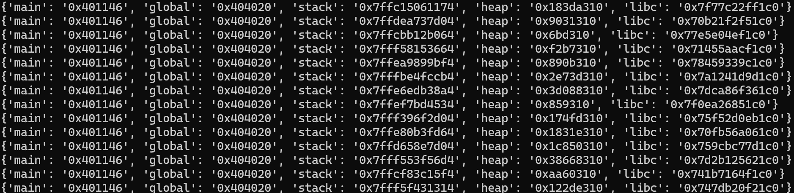
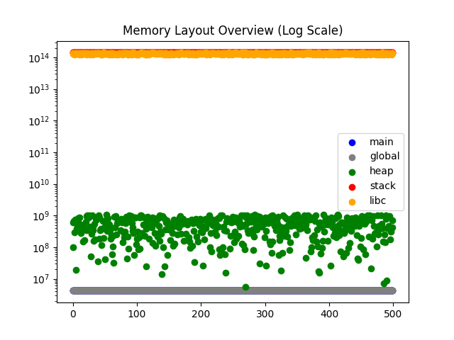
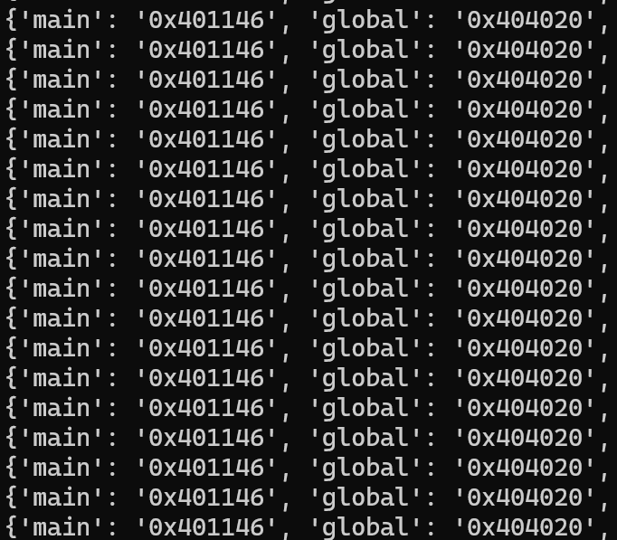
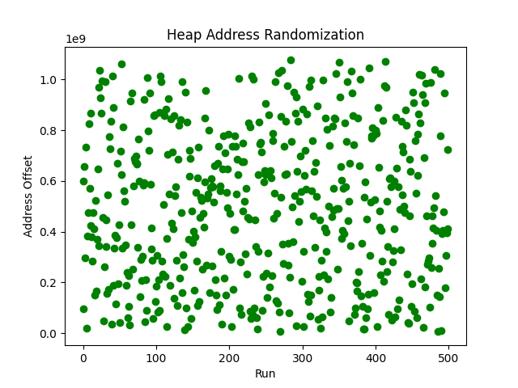
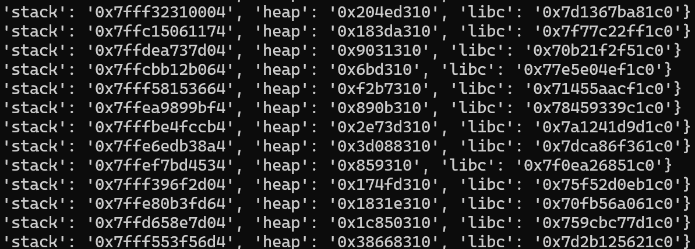
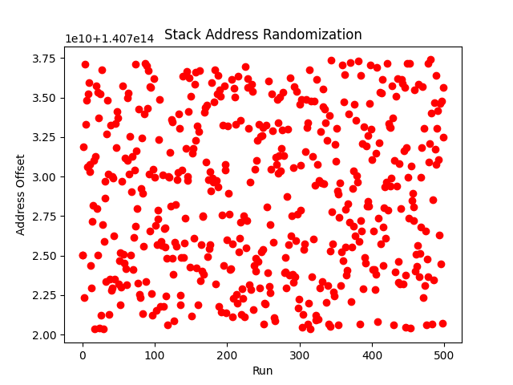
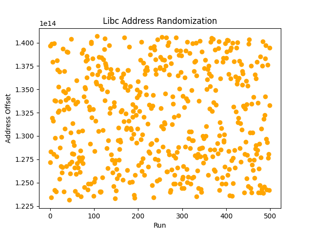
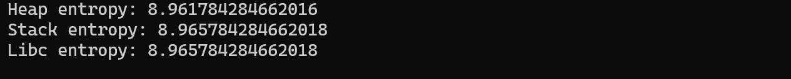

# How Much Randomness Does ASLR Really Provide?

## 1. Introduction: When Addresses Stop Being Reliable

When I solved the split challenge, I was able to calculate addresses using fixed offsets. However, Address Space Layout Randomization (ASLR) and Position Independent Executables (PIE) randomize memory layouts, making such calculations unreliable.

Knowing this, I wanted to observe how much randomness these mechanisms actually introduce.

## 2. What ASLR Actually Randomizes

First, I focused on ASLR alone. When ASLR is available, it randomly assigns an address for the major components for program such as stacks, shared libraries (libc), main program and heap. 

## 3. Experiment Setup

I prepared a simple C program (aslr_demo) based on a Qiita article (https://qiita.com/taharma/items/4b65d1776b0d3b55164f), compiled it without PIE.

I then used a Python script to run the program multiple times, collect address data, and visualize the results using Matplotlib.

## 4. Observations: What Changed and What Didn’t

I observed that the addresses for the main program and global variables remained constant, while the addresses for the stack, heap, and libc changed on every execution.

The five address ranges are shown together in the graph below.

The main program is not clearly visible in the graph because it is very close to the global variables and overlaps with them. However, like the global variables, it remains at a low address range and appears as a single line.

The heap shows a distinctive spread, covering a wide range of addresses across executions.

In contrast, the stack and libc appear as relatively tight, horizontal bands at higher address ranges.

### 4.1 Fixed Addresses (The Main Program & Global Variables)

The main program and global variables remained at fixed addresses across all executions because the program was compiled without PIE.

If PIE were enabled, these addresses would also be randomized, similar to other memory regions.

### 4.2 Heap Behavior

Even in the combined graph, the heap already appears highly variable.  

However, when we examine the addresses as offsets, the pattern becomes even clearer, as shown below.

### 4.3 Stack Behavior

In the memory layout overview (log scale), the stack overlaps with libc and is not easily distinguishable. However, its address is not fixed.

The stack addresses consistently fall within the 0x7ff... range, suggesting a narrower range compared to the heap. Despite this, the stack is still randomized across executions, as shown below.

### 4.4 Libc Behavior

Similar to the stack, libc addresses are not fixed.

Libc addresses consistently fall within the 0x7... range, but show a wider distribution compared to the stack.

### 4.5 Quantifying Randomness

As observed, all addresses are randomized except for the main program and global variables.

To better understand this behavior, we can quantify the randomness of these address distributions.

One simple way to do this is by measuring entropy, which captures how spread out the values are.

